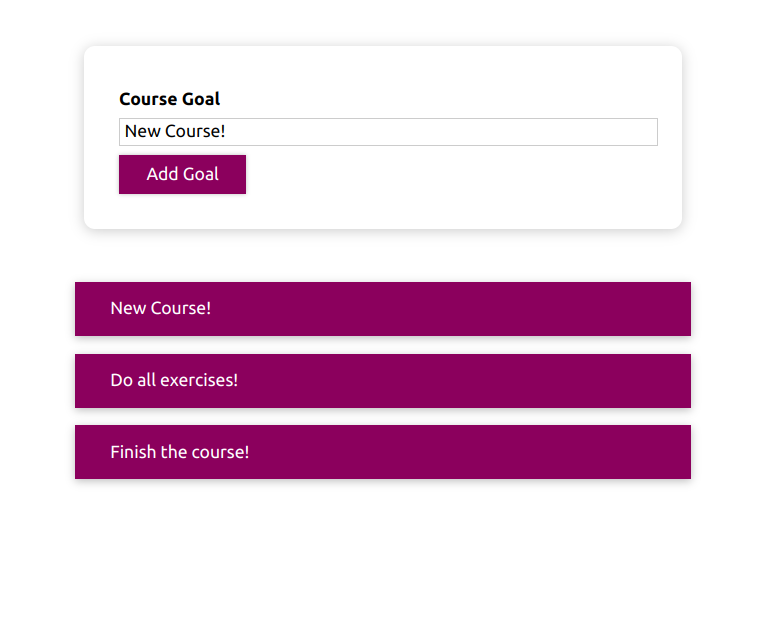
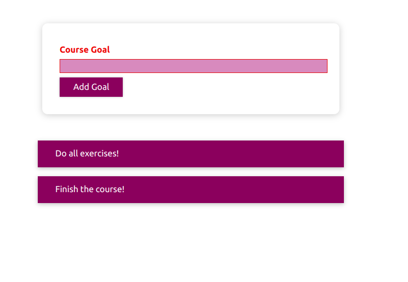
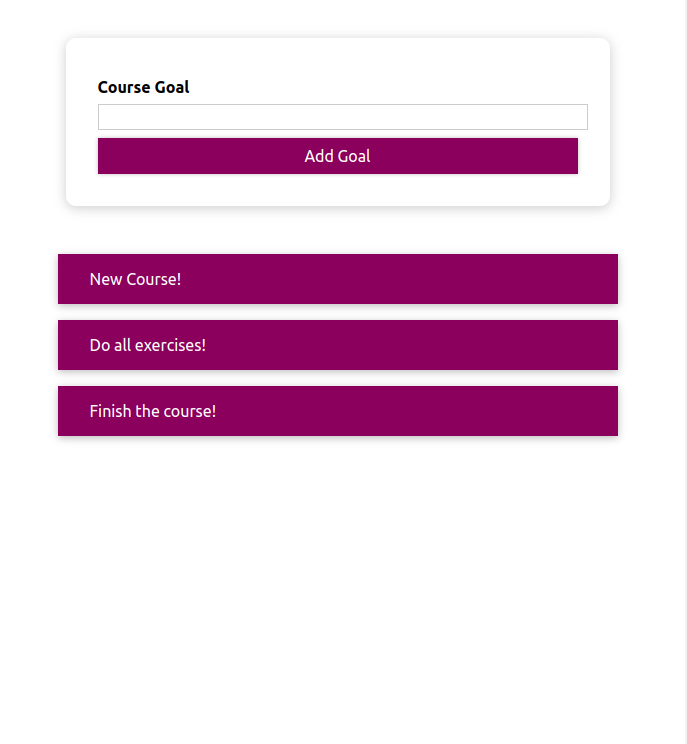

# React_ style

This repository is a practice to learn different methods of dynamic styling in react. The practiced methods are 'CSS Modules' and 'Styled Components'. The javascript code in this repository has been taken from [React - The Complete Guide (incl Hooks, React Router, Redux)](https://www.udemy.com/course/react-the-complete-guide-incl-redux/) course, but the dynamic styling parts are done by the author. 

# Demo

## Inserting normal input

## Empty input

## Smaller screens

